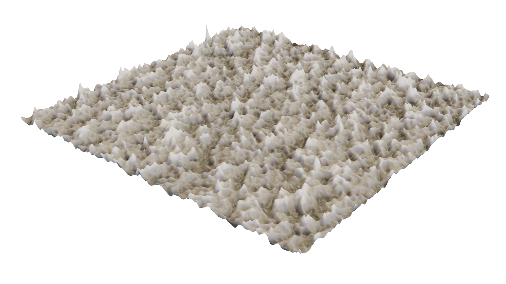

# BVSPM Library
A Python library designed to read, process, and analyze Bruker/Veeco Scanning Probe Microscopy (SPM) files (.spm). It extracts both binary heightmap data and metadata from proprietary AFM/SPM files, enabling calibrated surface roughness analysis.



## YOUTUBE TUTORIAL

[](https://youtu.be/99y9O1ZNkIY)

## Installation

There are two recommended ways to install the BVSPM library:
## Option 1: Standard Python Virtual Environment

### Prerequisites

Python 3.6 or higher (Python 3.10 recommended)
pip

Installation Steps

Clone the repository
```
git clone https://github.com/UGarCil/EyewearTerrains
cd EyewearTerrains
```
Create a virtual environment
Windows:
```
python -m venv bvspm-env
bvspm-env\Scripts\activate
```
macOS/Linux:
```
python -m venv bvspm-env
source bvspm-env/bin/activate
```
Install the package and dependencies
```
pip install -e .
```
Verify installation
```
python -c "import bvspm; print('BVSPM installed successfully!')"
```
Deactivate the environment when finished
```
deactivate
```

## Option 2: Anaconda Environment
Prerequisites

Anaconda or Miniconda installed

Installation Steps

Clone the repository
```
git clone https://github.com/UGarCil/EyewearTerrains
cd bvspm
```
Create a new conda environment with Python 3.11
```
conda create -n bvspm-env python=3.10
conda activate bvspm-env
```
Install the package and dependencies
```
pip install -e .
```
Alternatively, you can use the provided environment.yml file:
```
conda env create -f environment.yml
conda activate bvspm-env
```
Verify installation
```
python -c "import bvspm; print('BVSPM installed successfully!')"
```
Deactivate the environment when finished
```
conda deactivate
```

## Dependencies
### BVSPM requires the following Python packages:

numpy
matplotlib
scikit-image
scipy
